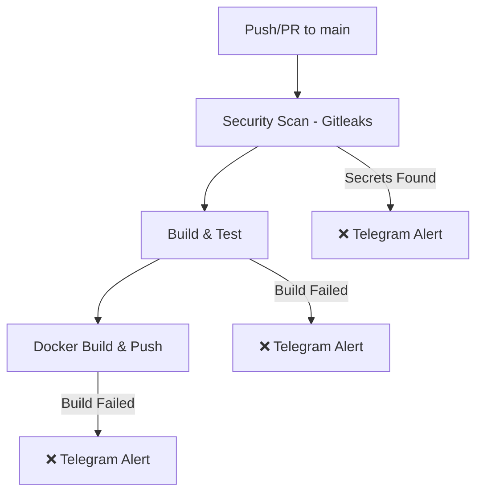
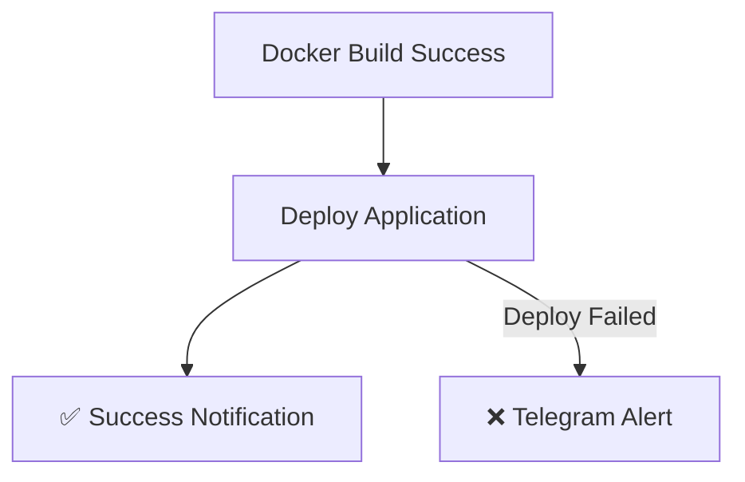

# 🚀 CICD Pipeline Demo với GitHub Actions, Docker và Gitleaks

## Mục tiêu

Dự án này minh họa một CI/CD pipeline hoàn chỉnh sử dụng:
- **GitHub Actions** cho automation
- **Docker** cho containerization
- **Gitleaks** cho security scanning (SAST)
- **Telegram** cho notifications

## 📋 Yêu cầu

### 1. Setup Repository
```bash
# Clone hoặc tạo repo mới trên GitHub
git init
git add .
git commit -m "Initial commit"
git branch -M main
git remote add origin https://github.com/your-username/cicd-demo.git
git push -u origin main
```

### 2. GitHub Secrets Configuration

Để pipeline hoạt động, bạn cần setup các secrets sau trong GitHub repo:

#### 2.1. Telegram Bot Setup
1. Tạo Telegram bot:
   - Nhắn tin cho [@BotFather](https://t.me/botfather)
   - Gửi `/newbot`
   - Đặt tên và username cho bot
   - Lưu **Bot Token**

2. Lấy Chat ID:
   - Add bot vào channel/group hoặc chat trực tiếp
   - Gửi tin nhắn cho bot
   - Truy cập: `https://api.telegram.org/bot<BOT_TOKEN>/getUpdates`
   - Tìm `"chat":{"id":CHAT_ID}`

#### 2.2. Thêm Secrets vào GitHub
Vào **Settings** → **Secrets and variables** → **Actions** → **New repository secret**:

- `TELEGRAM_BOT_TOKEN`: Token bot Telegram
- `TELEGRAM_CHAT_ID`: Chat ID để nhận thông báo

### 3. Container Registry Setup
Pipeline sẽ tự động push Docker images lên GitHub Container Registry (ghcr.io).

## 🏗️ Kiến trúc Pipeline

### CI Phase (Continuous Integration)


### CD Phase (Continuous Deployment)


## 🔧 Components Chi tiết

### 1. **GitHub Actions Workflow** (`.github/workflows/cicd.yml`)
- **security-scan**: Quét secrets bằng Gitleaks
- **build-and-test**: Build và test ứng dụng
- **docker-build**: Build và push Docker image
- **deploy**: Deploy ứng dụng (simulation)
- **notify-success**: Thông báo thành công

### 2. **Webapp** (`app.js`)
- Node.js Express server
- Health check endpoint
- API endpoints
- Modern UI hiển thị thông tin pipeline

### 3. **Docker Configuration**
- `Dockerfile`: Multi-stage build với security best practices
- `.dockerignore`: Loại trừ files không cần thiết
- Health checks tích hợp

### 4. **Security Scanning**
- Gitleaks: Quét hardcoded secrets
- Tự động fail pipeline nếu tìm thấy secrets
- Alert qua Telegram

## 🧪 Testing Local

### Chạy ứng dụng local:
```bash
npm install
npm start
# Truy cập http://localhost:3000
```

### Test Docker build:
```bash
docker build -t cicd-demo .
docker run -p 3000:3000 cicd-demo
```

### Test với Docker Compose:
```bash
docker-compose up --build
```

## 📱 Demo Scenarios

### ✅ Success Scenario
1. Tạo feature branch
2. Commit clean code (không có secrets)
3. Tạo Pull Request
4. Merge vào main
5. Pipeline chạy thành công → Telegram notification

### ❌ Failure Scenario
1. Commit code có hardcoded secrets
2. Push lên main branch
3. Gitleaks detect secrets
4. Pipeline fail → Telegram alert

## 🎯 Kết quả Demo

### Thành công:
- ✅ Security scan passed
- ✅ Build & test passed
- ✅ Docker image built
- ✅ Deployment successful
- ✅ Telegram notification sent

### Thất bại:
- ❌ Gitleaks found secrets
- ❌ Pipeline stopped
- ❌ Telegram security alert sent

## 📊 Monitoring & Alerts

### Telegram Notifications bao gồm:
- **Security Alerts**: Khi Gitleaks tìm thấy secrets
- **Build Failures**: Lỗi trong quá trình build/test
- **Docker Issues**: Lỗi build hoặc push image
- **Deployment Failures**: Lỗi trong deployment
- **Success Messages**: Thông báo pipeline thành công

### Thông tin trong alerts:
- Repository và branch
- Commit hash và author
- Link đến Action details
- Loại lỗi cụ thể
- Timestamp

## 🔍 CI vs CD Explanation

### **CI (Continuous Integration)**
- **Mục đích**: Tích hợp code changes liên tục
- **Giai đoạn**:
  - Security scanning (Gitleaks)
  - Code testing
  - Build application
  - Docker image creation

### **CD (Continuous Deployment)**
- **Mục đích**: Deploy tự động lên production
- **Giai đoạn**:
  - Deploy application
  - Health checks
  - Success notifications

## 🛠️ Tools & Công dụng

| Tool | Công dụng | Phase |
|------|-----------|-------|
| **GitHub Actions** | Automation platform, orchestrate pipeline | CI/CD |
| **Gitleaks** | SAST tool, scan hardcoded secrets | CI |
| **Docker** | Containerization, consistent deployment | CI/CD |
| **Telegram API** | Real-time notifications | CI/CD |
| **Node.js/Express** | Web application framework | App |

## 📈 Best Practices Implemented

1. **Security First**: Gitleaks scanning trước khi build
2. **Fail Fast**: Stop pipeline ngay khi có security issues
3. **Multi-stage Docker**: Optimize image size và security
4. **Non-root User**: Run container với user không phải root
5. **Health Checks**: Monitor container health
6. **Caching**: GitHub Actions cache để tăng tốc
7. **Multi-platform**: Build cho cả AMD64 và ARM64
8. **Real-time Alerts**: Thông báo ngay lập tức qua Telegram

## 🚨 Security Considerations

- Secrets được store an toàn trong GitHub Secrets
- Container chạy với non-root user
- Dependencies được scan và update thường xuyên
- Network security với proper port exposure
- Container registry authentication

## 🔄 Workflow Triggers

- **Push to main/master**: Full CI/CD pipeline
- **Pull Request**: CI only (security + build + test)
- **Manual trigger**: Có thể trigger manually từ GitHub UI

## 📚 Learning Outcomes

Sau khi complete project này, bạn sẽ hiểu:
- Cách thiết kế và implement CI/CD pipeline
- Security scanning integration (SAST)
- Docker best practices
- Infrastructure as Code với GitHub Actions
- Real-time monitoring và alerting
- DevOps workflows và automation
