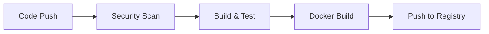
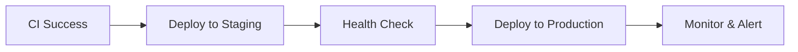
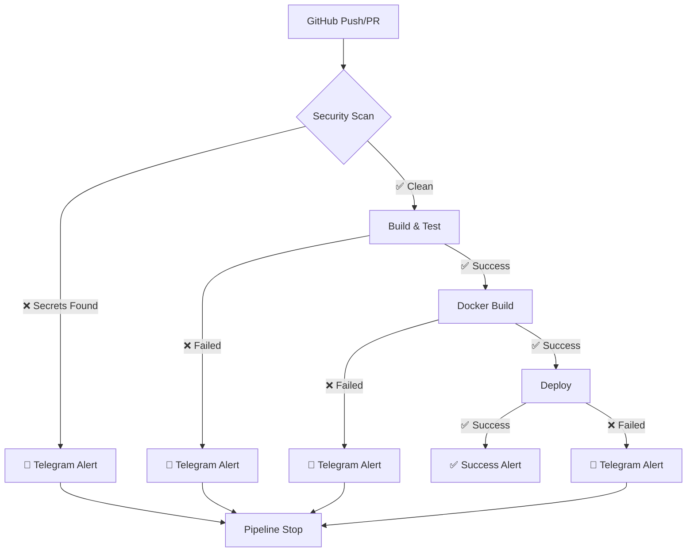

# 🚀 CI/CD Pipeline với GitHub Actions, Docker & Gitleaks

---

## 📋 Agenda

1. **Tổng quan về CI/CD**
2. **Kiến trúc Pipeline**
3. **CI Phase - Continuous Integration**
4. **CD Phase - Continuous Deployment**
5. **Tools & Technologies**
6. **Demo Scenarios**
7. **Best Practices**
8. **Q&A**

---

## 🎯 Mục tiêu Project

### Xây dựng pipeline tự động hóa:
- ✅ **CI**: Build, Test, Security Scan
- ✅ **CD**: Deploy application
- ✅ **Security**: Gitleaks SAST integration
- ✅ **Monitoring**: Telegram notifications
- ✅ **Containerization**: Docker deployment

### Yêu cầu thực hiện:
- GitHub Actions workflow
- Docker containerization
- Gitleaks security scanning
- Real-time alerts via Telegram
- Demo success & failure scenarios

---

## 🔄 CI vs CD - Phân biệt rõ ràng

### **CI - Continuous Integration**


**Mục đích**: Tích hợp code changes liên tục và đảm bảo quality

**Các giai đoạn**:
- 🔐 **Security Scanning**: Gitleaks detect secrets
- 🧪 **Build & Test**: Compile và run tests  
- 🐳 **Docker Build**: Containerize application
- 📦 **Artifact Storage**: Push to container registry

---

### **CD - Continuous Deployment**


**Mục đích**: Deploy tự động và reliable lên production

**Các giai đoạn**:
- 🚀 **Automated Deployment**: Deploy to target environment
- 💚 **Health Monitoring**: Verify application health
- 📢 **Notifications**: Success/failure alerts
- 🔄 **Rollback**: Tự động rollback nếu có lỗi

---

## 🏗️ Kiến trúc Pipeline

### Workflow Overview


### Pipeline Jobs
1. **security-scan**: Chạy Gitleaks SAST
2. **build-and-test**: Build application và run tests
3. **docker-build**: Build & push Docker image
4. **deploy**: Deploy to target environment
5. **notify-success**: Send success notification

---

## 🔐 CI Phase - Security First

### **Job 1: Security Scan**
```yaml
security-scan:
  runs-on: ubuntu-latest
  steps:
    - uses: actions/checkout@v4
    - uses: gitleaks/gitleaks-action@v2
```

**Chức năng**:
- Scan toàn bộ repository tìm hardcoded secrets
- Sử dụng Gitleaks rules để detect patterns
- **Fail fast**: Stop pipeline ngay lập tức nếu tìm thấy secrets
- Alert qua Telegram với chi tiết lỗi

**Lợi ích**:
- 🛡️ Bảo mật ngay từ đầu pipeline  
- 💰 Tiết kiệm resources (không build nếu có security issue)
- 📢 Alert tức thì cho dev team

---

### **Job 2: Build & Test**
```yaml
build-and-test:
  needs: security-scan
  runs-on: ubuntu-latest
  steps:
    - uses: actions/setup-node@v4
    - run: npm ci
    - run: npm test
```

**Chức năng**:
- Setup Node.js environment
- Install dependencies với `npm ci` (faster, reliable)
- Run unit tests và integration tests
- Verify code quality và functionality

**Dependencies**: Chỉ chạy khi security-scan thành công

---

### **Job 3: Docker Build & Push**
```yaml
docker-build:
  needs: [security-scan, build-and-test]
  runs-on: ubuntu-latest
  steps:
    - uses: docker/build-push-action@v5
```

**Chức năng**:
- Multi-platform build (AMD64, ARM64)
- Layer caching để tăng tốc builds
- Push to GitHub Container Registry (ghcr.io)
- Generate image tags và metadata

**Security Features**:
- Non-root user trong container
- Minimal Alpine Linux base image
- Health check endpoints
- Proper file permissions

---

## 🚀 CD Phase - Deployment & Monitoring

### **Job 4: Deploy Application**
```yaml
deploy:
  needs: docker-build
  runs-on: ubuntu-latest
  steps:
    - name: Deploy (Simulation)
      run: echo "Deploying to production..."
```

**Trong thực tế sẽ include**:
- Deploy to Kubernetes cluster
- Update load balancer configuration  
- Run database migrations
- Configure environment variables
- Health check verification

**Current Implementation**: Simulation để demo concept

---

### **Job 5: Success Notification**
```yaml
notify-success:
  needs: [security-scan, build-and-test, docker-build, deploy]
  steps:
    - uses: appleboy/telegram-action@master
```

**Chức năng**:
- Chỉ chạy khi TẤT CẢ jobs trước đó thành công
- Send comprehensive success message
- Include deployment details và links
- Confirm application is live

---

## 🛠️ Tools & Technologies Deep Dive

### **GitHub Actions**
- **Là gì**: Cloud-based CI/CD platform
- **Tại sao chọn**: 
  - Free cho public repos
  - Native GitHub integration
  - Powerful workflow syntax
  - Large marketplace của actions

**Trong project**:
- Orchestrate entire pipeline
- Handle parallel job execution  
- Manage secrets securely
- Provide detailed logging

---

### **Docker**
- **Là gì**: Containerization platform
- **Tại sao chọn**:
  - Consistent environment (dev = prod)
  - Lightweight và portable
  - Easy scaling và deployment
  - Industry standard

**Trong project**:
- Package application với dependencies
- Multi-stage build để optimize size
- Security hardening với non-root user
- Health checks cho monitoring

---

### **Gitleaks (SAST Tool)**
- **Là gì**: Static Application Security Testing
- **Tại sao chọn**:
  - Detect hardcoded secrets  
  - Fast và accurate scanning
  - Easy GitHub Actions integration
  - Comprehensive rules database

**Trong project**:
- Prevent credential leaks
- Fail fast security approach
- Alert team về security issues
- Maintain security compliance

---

### **Telegram API**
- **Là gì**: Messaging platform với bot API
- **Tại sao chọn**:
  - Real-time notifications
  - Easy setup và configuration
  - Rich message formatting
  - Reliable delivery

**Trong project**:
- Instant pipeline status updates
- Detailed error information
- Success confirmations
- Links to action details

---

## 🎭 Demo Scenarios

### ✅ **Success Scenario**

**Flow**:
1. Developer pushes clean code to main branch
2. GitHub Actions triggers pipeline
3. **Security Scan** ✅ No secrets found  
4. **Build & Test** ✅ All tests pass
5. **Docker Build** ✅ Image created & pushed
6. **Deploy** ✅ Application deployed
7. **Telegram** 📱 Success notification sent

**Outcome**: 
- Application is live
- Team được thông báo thành công  
- Docker image available trong registry
- All checks passed

---

### ❌ **Failure Scenario**

**Flow**:
1. Developer accidentally commits code có hardcoded secrets
2. GitHub Actions triggers pipeline  
3. **Security Scan** ❌ Gitleaks detects secrets
4. **Pipeline STOPS** immediately
5. **Telegram** 🚨 Security alert sent

**Outcome**:
- Pipeline fails fast (saves time & resources)
- Developer gets immediate feedback
- Security breach prevented  
- No deployment occurs

---

## 📊 Monitoring & Alerting Strategy

### **Alert Types**

#### 🚨 **Security Alerts**
```
🚨 SECURITY ALERT 🚨
Repository: user/repo
Branch: main  
Gitleaks found potential secrets!
Please review and remove hardcoded secrets.
```

#### ❌ **Build Failures**  
```
❌ BUILD FAILED ❌
Build or tests failed during CI phase.
View details: [Action Link]
```

#### ✅ **Success Notifications**
```
✅ PIPELINE SUCCESS ✅
🔐 Security Scan: ✅ Passed
🧪 Build & Test: ✅ Passed  
🐳 Docker Build: ✅ Completed
🚀 Deployment: ✅ Successful
Application URL: https://your-app.com
```

---

## 🏆 Best Practices Implemented

### **Security First**
- ✅ Security scanning trước build
- ✅ Fail fast approach
- ✅ Secure secrets management
- ✅ Non-root container execution
- ✅ Minimal attack surface

### **Performance Optimization**
- ✅ Parallel job execution
- ✅ Docker layer caching
- ✅ npm ci instead of npm install
- ✅ Multi-platform builds
- ✅ Efficient resource usage

### **Reliability & Monitoring**  
- ✅ Health checks
- ✅ Proper error handling
- ✅ Real-time notifications
- ✅ Comprehensive logging
- ✅ Rollback capability

---

## 📈 Results & Achievements

### **Technical Deliverables**
- ✅ Complete CI/CD pipeline
- ✅ Dockerized Node.js application  
- ✅ Security scanning integration
- ✅ Real-time alerting system
- ✅ Comprehensive documentation

### **Learning Outcomes**
- ✅ CI/CD concepts và implementation
- ✅ Container security best practices
- ✅ Infrastructure as Code
- ✅ DevOps workflow automation
- ✅ Security-first development approach

### **Demo Capabilities**
- ✅ Success pipeline execution
- ✅ Security failure detection
- ✅ Real-time notifications
- ✅ Multi-platform deployment
- ✅ Production-ready setup

---

## 🚀 Next Steps & Improvements

### **Production Enhancements**
- 🔄 Real deployment to Kubernetes/Cloud
- 🧪 More comprehensive testing (e2e, performance)
- 📊 Advanced monitoring với Prometheus/Grafana
- 🔐 Additional security scans (OWASP, dependency check)
- 📦 Staging environment setup

### **Scalability Improvements** 
- 🏗️ Infrastructure as Code (Terraform)
- 🔄 GitOps workflow với ArgoCD
- 📈 Auto-scaling configuration
- 💾 Database migration automation
- 🌐 CDN và caching strategies

---

## ❓ Q&A

### **Common Questions**

**Q: Tại sao Gitleaks quan trọng?**
A: Prevent credential leaks, comply với security standards, protect production systems

**Q: Docker có cần thiết không?**  
A: Đảm bảo consistency giữa environments, easy scaling, industry standard

**Q: Có thể dùng Jenkins thay GitHub Actions?**
A: Có, nhưng GitHub Actions native integration và easier setup

**Q: Chi phí của setup này?**
A: Free cho public repos, very low cost cho private repos

---

## 🎉 Thank You!

### **Project Repository**
📂 GitHub: `your-username/cicd-demo`

### **Demo Commands**
```bash
./demo-scripts.sh github-setup  # Setup instructions
./demo-scripts.sh local          # Run locally  
./demo-scripts.sh docker         # Docker demo
./demo-scripts.sh gitleaks-fail  # Security failure demo
```

### **Contact & Questions**
- 📧 Email: your-email@domain.com
- 💬 Telegram: @your-username
- 🐙 GitHub: @your-username

---

**🚀 Ready to implement DevOps in your projects!**
